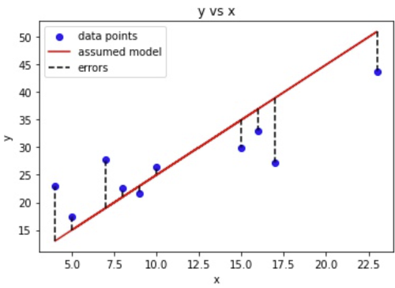

<script type="text/javascript" async src='https://cdnjs.cloudflare.com/ajax/libs/mathjax/2.7.2/MathJax.js?config=TeX-MML-AM_CHTML'></script>

<script type="text/x-mathjax-config">
  MathJax.Hub.Config({ TeX: { extensions: ["color.js"] }});
</script>

<div markdown="1" class="container">

<div class="postTitle"> Linear Regression From Scratch </div>
<div class="desc"> Creating a Linear Regression Machine Learning Model from Scratch in Python </div>
<div class="postDate"> Posted by David Wang on March 31, 2023 </div>

## Introduction

Linear Regresion is a machine learning model that aims to draw a best-fitted straight line through a set of data points. The goal is to use this line to describe the relationship between the input variables (independent variables) and the output variable (dependent variable). 

While machine learning libraries like scikit-learn can find the optimal regression line (as i have used [here](https://github.com/davidw102403/linear_regression_scikit)), it won't provide understanding of the underlying mathematics of the model. Implementing the model from scratch in python will allow us to gain a deeper understanding of how the algorithm works. 

## The Math

The basic framework of linear regression follows a linear function with structure:

$$
y = m \cdot x + b
$$

The gradient, denoted by __*m*__, and the intercept, denoted by __*b*__, are the two unknown parameters that we need to determine in linear regression. To solve for these parameters, we can use a loss function and the gradient descent algorithm.

### Loss Function - Mean Squared Error

To find the values of __*m*__ and __*b*__, we need to know how far each data point is from the regression line. This error can be calculated with a loss function. In this case, the mean squared error loss function can be used to calculate the distance between the regression line and the data point.



Using the mean squared error loss function, we take the distance between the data points and the regression line, square it, add it up for all data points, and then divide by the number of data points. In other words, we are taking the mean of the sum of the squared errors: 

$$
E = \frac{1}{n} \cdot \sum_{i=1}^{n} (y_i - \bar{y}_i)^2
$$

substituting in the equation of the regression line, we get:

$$
E = \frac{1}{n} \cdot \sum_{i=1}^{n} (y_i - (m \cdot x_i + b))^2
$$

We can now find the regression line of best fit by minimizing this function for error.

### Gradient Descent 

Gradient descent works by iteratively adjusting the model parameters in the direction of steepest descent of the error function. At each iteration, the algorithm calculates the gradient of the error function with respect to the model parameters. The algorithm then updates the model parameters by taking a step in the negative gradient direction.

Think of it like walking down a hill to find the lowest point. You take steps in the direction that leads you downhill, until you reach the bottom. In the same way, gradient descent takes steps in the direction of decreasing error, until it reaches the lowest possible value of the error function.

The size of the step is determined by the learning rate hyperparameter, which controls how far the algorithm moves in the negative gradient direction at each iteration. If the learning rate is too large, the algorithm may overshoot the minimum of the error function and fail to converge. If the learning rate is too small, the algorithm may take a long time to converge.

The learning rate is like the size of the steps you take. If you take steps that are too big, you might overshoot the minimum point and end up climbing up the hill again. If you take steps that are too small, it might take a long time to get to the bottom of the hill. So, the learning rate has to be chosen carefully to balance between speed and accuracy.

Taking the partial derivative of the error function with respect to __*m*__ and __*b*__: 

$$ 
\frac{\partial E}{\partial m} = -\frac{2}{n} \sum_{i=1}^{n} x_i \cdot (y - (m \cdot x_i + b))
$$

$$ 
\frac{\partial E}{\partial b} = -\frac{2}{n} \sum_{i=1}^{n} (y - (m \cdot x_i + b))
$$

Scaling the gradient by learning rate __*L*__ tells us how much we need to change the parameters. Since the gradient gives the direction of steepest increase, the negative gradient gives the direction of steepest decrease, which is what we want (to minimize the error function). Applying the changes at each interation: 

$$
m = m - L \cdot \frac{\partial E}{\partial m}
$$

$$
b = b - L \cdot \frac{\partial E}{\partial b}
$$

And thats it. We have successfully defined an algorithm to find parameters for __*m*__ and __*b*__, which we can use to find the linear regression line. Now all that's left is to implement it in code. 

## Implementing Linear Regression In Python

### Loss Function and Gradient Descent 

We will be using Pandas to load the data and Matplotlib to visualize the results.

```python
import pandas as pd
import matplotlib.pyplot as plt
```

Next, load in a csv file with data (x-values and y-values).

```python 
data = pd.read_csv('data.csv')
```

We can start by defining the loss function.

```python
def loss_function(m, b, data):
    total_error = 0
    for i in range(len(data)):
        x = data.iloc[i, 0]
        y = data.iloc[i, 1]
        total_error += (y - (m * x + b)) ** 2
    return total_error / float(len(data))
  ```

The function takes in the parameters *m*, *b*, and the *data* points. It then loops through the number of rows/the number of data points. Using the *iloc* function, we extract each x and y coordinate from each row of the data (each data point). Then we apply the mean squared error function for each itteration. Finally, we return mean of the total error. 

The next step is to define the gradient descent function.

```python
def gradient_descent(m_now, b_now, data, L):
  m_gradient = 0
  b_gradient = 0
  n = float(len(data))
  for i in range(len(data)):
    x = data.iloc[i, 0]
    y = data.iloc[i, 1]
    m_gradient += -(2/n) * x * (y - (m_now * x + b_now))
    b_gradient += -(2/n) * (y - (m_now * x + b_now))
  m = m_now - L * m_gradient
  b = b_now - L * b_gradient
  return [m, b]
```

The function takes in parameters *m_now*, *b_now*, *data*, and *L*, representing the current m value, current b value, data points, and step size. It then loops through each data point, calculating and updating the gradient of the error function with respect to m and b. It then updates the final values of m and b that are used in the regression line, returning them in a list. The step size, *L*, determines the factor by which we change *m* and *b*.

### Training the Model

To train the model, start by setting *m* and *b* both to zero, *L = 0.00001* and a variable *epochs = 100*. 

```python
m = 0
b = 0
L = 0.00001
epochs = 100

for i in range(epochs):
    m, b = gradient_descent(m, b, data, L)

print(m, b)
```

*Epochs* defines how many times the gradient_descent function will be applied or how many "steps". Starting from zero, each "step" updates the values of *m* and *b* until the error function is minimized and the line of best fit is acheived. 

the results of *m* and *b*:

```python
1.4567543102446447 0.027979592525960988
```

We can easily use this model to make predictions by defining a simple method:

```python
def predict(x_input):
  return m * x_input + b
```

### Plotting the Results

To visualize the linear regression, we will plot both the calculated regression line and the error function using matplotlib. Start by creating two subplots.

```python
fig = plt.figure()
ax1 = fig.add_subplot(2, 1, 1)
ax2 = fig.add_subplot(2, 1, 2)
ax1.set_title("Linear Regression Model")
ax2.set_title("Loss Function vs Time")
```

Then we set the axis limits for the loss function plot. The function runs from 0 to epochs, so we'll set that to be the limits on x. Since the goal is to visualize how the error decreases, we can set the y-limits from 0 to the initial value of the loss function. Then, plot the data points on the first subplot. 

```python
ax2.set_xlim([0, epochs])
ax2.set_ylim([0, loss_function(m, b, data)])

ax1.scatter(data.iloc[:, 0], data.iloc[:, 1])
```

Define a starting line for the regression model and a starting point for the loss function.

```python
line1, = ax1.plot(range(20, 80), range(20, 80), color='r')
line2, = ax2.plot(0, 0, color='r')
```

Apply the gradient descent function for each iteration to calculate the values for m and b and set the y-values of the regression model to reflect the calculated line of best fit. At the same time, apply the loss function to calculate the error for each iteration, appending the values to a list for y values. Similarly, append each i value to a list of x values (reflecting increasing time). Finally, to visualize how error changes over time, set both the x_data and y_data of the loss function plot to these lists of changing values.

```python
xlist = []
ylist = []

for i in range(epochs):
    m, b = gradient_descent(m, b, data, L)
    line1.set_ydata(m * range(20, 80) + b)

    xlist.append(i)
    ylist.append(loss_function(m, b, data))
    line2.set_xdata(xlist)
    line2.set_ydata(ylist)

plt.tight_layout()
plt.show()
```

The final result:


[code](https://github.com/davidw102403/LinearRegressionFromScratch)


