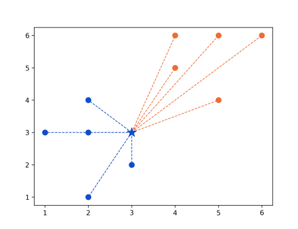
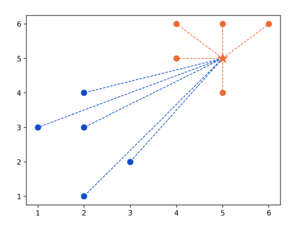

<script type="text/javascript" async src='https://cdnjs.cloudflare.com/ajax/libs/mathjax/2.7.2/MathJax.js?config=TeX-MML-AM_CHTML'></script>

<script type="text/x-mathjax-config">
  MathJax.Hub.Config({ TeX: { extensions: ["color.js"] }});
</script>

<div markdown="1" class="container">

<div class="postTitle"> K-Nearest Neighbors From Scratch </div>
<div class="desc"> Creating a K-Nearest Neighbors Classifier Machine Learning Model from Scratch in Python </div>
<div class="postDate"> Posted by David Wang on April 10, 2023 </div>

## Introduction

Classification is a supervised machine learning process that categorizes data points into classes. The K-Nearest Neighbors model is a classification model that works by looking at a data point's *k nearest neighbors* and seeing which class has more closer points.


In the example above, there are two classes: overweight and underweight. They are determined by two parameters: height and weight. A new, unclassified point is passed in. The algorithm proceeds by identifying the *k=5* nearest neighbors. The new point would be classified as *underweight*, as there are more neighbors from the underweight class. 

## The Math

The k-nearest neighbors algorithm uses the *euclidean distance* between points, which is given by the following formula: 

$$ 
d(p, q) = \sqrt{\sum_{i=1}^n (q_i-p_i)^2}
$$

This formula calcualtes the distance between two points, *p and q*, in *n* dimensional space by taking the square root of the sum of the squared distances between the coordinates of two points. In 2D, the formula is:

$$ 
d(p, q) = \sqrt{(q_1-p_1)^2 + (q_2-p_2)^2}
$$

In 3D: 

$$ 
d(p, q) = \sqrt{(q_1-p_1)^2 + (q_2-p_2)^2 + (q_3-p_3)^2}
$$

As you can see, for each increase in dimension, we sum up another $$ (q_i-p_i)^2 $$ term, which is why the summation is there in the generalized eulidean distance formula. 

## Implementing in Python

Import the following libraries.

```python
import numpy as np
import matplotlib.pyplot as plt
from collections import Counter
```

numpy is used for working with arrays, matplotlib for visualizing the results, and Counter for counting the appearances in arrays.

```python
points = {'blue': [[2,4], [1,3], [2,3], [3,2], [2,1]],
          'orange': [[5,6], [4,5], [4,6], [6,6], [5,4]]}

new_point = [3,3]
```

Next, we create a dictionary with our labaled training data and a new point that we want to classify.

```python
class K_Nearest_Neighbors:

    def __init__(self, k=3):
        self.k = k

    def fit(self, points):
        self.points = points
```

We then define a class K_Nearest_Neighbors that has a constructor that k to a default value of 3 if no other value is provided. Then, we create an instance method fit that takes in a set of data points and stores it to the instance variable self.points.

```python
    def euclidean_distance(self, p, q):
        return np.sqrt(np.sum(np.array(p) - np.array(q)) ** 2)
```

We then create an instance method euclidean distance that takes in two points and returns the euclidean distance between them using the formula above.

```python
    def predict(self, new_point):
        distances = []

        for category in self.points:
            for point in self.points[category]:
                distance = self.
                euclidean_distance(point, new_point)
                distances.append([distance, category])

        categories = [category[1] for category in 
                    sorted(distances)[:self.k]]

        result = Counter(categories).most_common(1)[0][0]
        return result
```

Finally, we create a predict instance method that takes in a new point. A new list *distances* is created to store each calculated distance between the *new_point* and the data points stored in the *self.points* instance variable (set by the *fit* method). We then loop through the data points by category, calling the *euclidean_distance* method on each data point. The resulting distance between each data point and the *new_point* is appended to the *distances* list, as well as the data point's category. When the loop finishes, *distances* will be a list of tuples of length 2. 

Next, create a list *categories* using python's list comprehension. *sorted(distances)* sorts the *distances* list in aescending order, based on the first argument in each sublist. We then loop through the sorted list of distances, extracting the second argument (category) of each sublist using *category[1]*. The list is then indexed from 0 to k using *[:self.k]*. The resulting *categories* list is the k nearest points labeled by category. 

The result of the classification is calculated by applying *Counter(categories)*, which generates a map with each category mapped to it's frequency. the *most_common(1)* method is applied, which returns the most common category as tuple inside a list. *[0][0]* is used to extract the most common category, which is the result of the classification. 

```python
model = K_Nearest_Neighbors(k=3)
model.fit(points)
print(model.predict(new_point))
```

Apply the algorithm by instantiating the class and calling the *fit* and *predict* methods.

The result: 

```python
blue
```

## Visualizing the results
We can check our result by plotting the points. 

```python
ax = plt.subplot()

[ax.scatter(point[0], point[1], color='#104DCA', s=60) 
 for point in points['blue']]
[ax.scatter(point[0], point[1], color='#EF6C35', s=60) 
 for point in points['orange']]
```

Create an Axis object and use the scatter method to plot the blue and orange data points. 

```python
new_class = clf.predict(new_point)

if new_class == 'orange':
    color = '#EF6C35'
else:
    color = '#104DCA'

ax.scatter(new_point[0], new_point[1], color=color, 
 marker='*', s=200, zorder=100)
```

Classify the *new_point* using the model and set the color depending on result and plot it. 

```python 
[ax.plot([new_point[0], point[0]], [new_point[1], point[1]], 
 color='#104DCA', linestyle='--', linewidth=1) 
  for point in points['blue']]

[ax.plot([new_point[0], point[0]], [new_point[1], point[1]], 
 color='#EF6C35', linestyle='--', linewidth=1) 
  for point in points['orange']]
```

Draw lines between *new_point* and data points to visualize distance. 

Result:



Changing new_point to (5,5):



[code](https://github.com/davidw102403/k-nearest-neighbors-scratch)