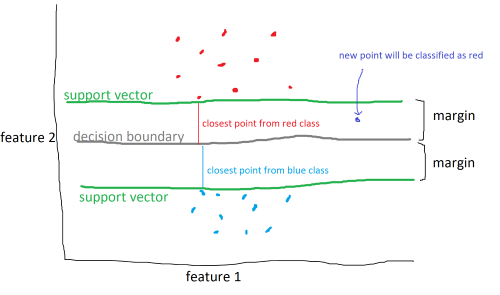
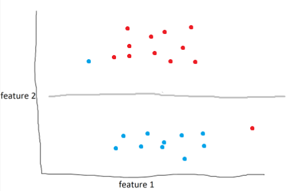

<script type="text/javascript" async src='https://cdnjs.cloudflare.com/ajax/libs/mathjax/2.7.2/MathJax.js?config=TeX-MML-AM_CHTML'></script>

<script type="text/x-mathjax-config">
  MathJax.Hub.Config({ TeX: { extensions: ["color.js"] }});
</script>

<div markdown="1" class="container">

<div class="postTitle"> Support Vector Machines </div>
<div class="desc"> Support Vector Machines and how they work </div>
<div class="postDate"> Posted by David Wang on April 14, 2023 </div>

## Introduction
Support vector machines are a powerful supervised machine learning model that classifies new data (much like [KNN](https://davidwangdev.com/k_neighbors)). The difference is, instead of calculating the k-closest neighbors, SVM's use a mathematical function to split the data in some way. And not just some way, but the most optimal way. 


The data above are categorized into two different classes and are split by three lines. There are an infinite number of lines that split the data. The SVM algorithm aims to find the line, known as a **decision boundary**, that maximizes the **margin**, which is the distance between the decision boundary to the closest point from each class, called the **support vectors**. 



However, data won't always be easy to split. In some cases, classes may overlap or it may not be clear how to divide the classes.


As seen above, although it is clear that the data lie in two different classes, it isn't clear where the decision boundary should be. 

The solution is to use a **kernel function** or kernels. A kernel function adds an additional feature, or dimension, to the data. In the example above, a kernel function could attempt to raise the blue points above the red points and drop a hyper-plane between them to act as a decision boundary. the data couldn't be seperated in the second dimension, so we do it in the third. It is important to note that the kernel function does not add any additional data. It uses feature 1 and feature 2 to generate feature 3. 

SVM's can also utilize **soft margins** to create more intelligent decision boundaries.

 

In the example above, the model draws the optimal line to seperate blue and red. However, as humans, it's obvious that this isn't the best line. What we can do is define a soft margin of 2 to allow for miss-classifications of up to two points. Soft margins are basically a tolerance that we can use to make our model more accurate in general. 

With a soft margin of 2, the decision boundary would look something like:



## Implementing SVC using sklearn

We will import breast cancer data and train and test a SVM classifier to classify tumors as malignant/benign. 

```python
from sklearn.datasets import load_breast_cancer
from sklearn.model_selection import train_test_split
from sklearn.svm import SVC 
from sklearn.neighbors import KNeighborsClassifier

data = load_breast_cancer()

x = data.data
y = data.target 
```

Next, we split the data. 80% for training the model, 20% for testing.

```python
x_train, x_test, y_train, y_test = 
 train_test_split(x, y, test_size=0.2)
```

Create an SVM classifier model with a linear kernel and a soft margin of 5.
```python
clf = SVC(kernel='linear', C=5)
```

Train the model.
```python
clf.fit(x_train, y_train)
```

Test the model.
```python
print(f'SVC: {clf.score(x_test, y_test)}')
```

Output: 
```python
SVC: 0.9736842105263158
```

The SVM model can classify new tumors with 92-97% accuracy. 

As a bonus, we can compare SVM and KNN classifiers.
Create, train, and test KNN model

```python
clf2 = KNeighborsClassifier(n_neighbors=5)
clf2.fit(x_train, y_train)
print(f'KNN: {clf2.score(x_test, y_test)}')
```

Output:
```python
KNN: 0.9385964912280702
```

The results of the two models are generally very close, with the SVM classifier outperforming KNN occasionally. 

