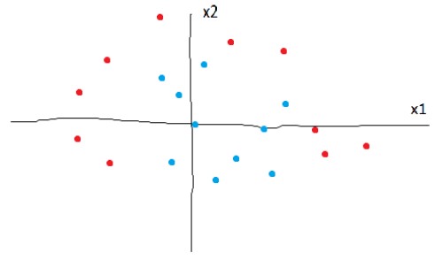
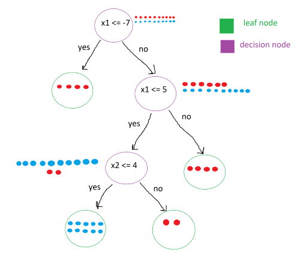
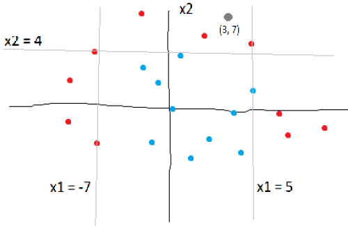
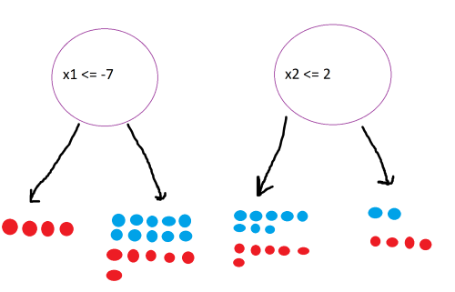
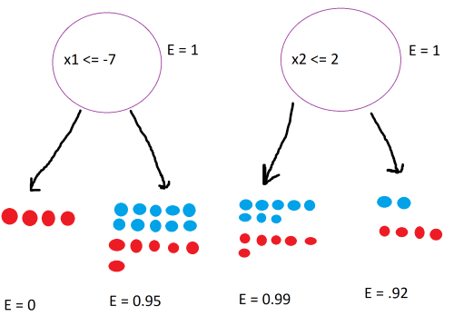

<script type="text/javascript" async src='https://cdnjs.cloudflare.com/ajax/libs/mathjax/2.7.2/MathJax.js?config=TeX-MML-AM_CHTML'></script>

<script type="text/x-mathjax-config">
  MathJax.Hub.Config({ TeX: { extensions: ["color.js"] }});
</script>

<div markdown="1" class="container">

<div class="postTitle"> Decision Tree Classifiers </div>
<div class="desc"> The intuition and math behind DTC's </div>
<div class="postDate"> Posted by David Wang on April 15, 2023 </div>

## Introduction
Decision tree classifiers are a supervised machine learning model that recursively splits data until you are left with pure leaf nodes (data of only one class). This post seeks to explore what that means and how the DTC works. 

# Decision Tree Classification
Explaining DTC's is best done through an example. Let's say you are given a data set with two classes (red and blue) and two features (x1 and x2). The data, however, cannot be seperated into two classes easily. 



Next, we will look at a trained decision tree clasifier for this data set:



The tree consists of two different types of nodes: decision nodes, and leaf nodes. As you can see, each decision node has a condition. The points that satisfy the condition are moved to the left child node while the points that do not are moved into the right child node. This process continues until the leaf nodes are "pure", meaning that they only contain points of one class. 

To classify a new point, all that needs to be done is to traverse the tree, following the conditions. For example, to classify the point (3, 7), we first check the root node. 3 is not less than -7 so it goes to the right decision node. We check it's condition, and it passes, sending it to the left decision node. We check it's condition, x2 <= 4. It fails, sending it to the right leaf node. Luckily all the points in this leaf node are red, so we can classify the new point as red. 

The conditions of the decision nodes can be visualized on the original plot:



In real life, however, leaf nodes may not be 100% pure, meaning that they may contain points from other classes. In this case, we take the most common class and assign it as the classification. 

# Math
At this point, you might be asking: this is just a bunch of if and if-else statements; how is this machine learning? The answer lies in finding the optimal conditions for dividing the data. 



Above shows two different splits. As humans, we can tell that the first split is better, since it produces a leaf node of only reds. But how does the computer know that? The answer lies in information theory. Specifically, the model will choose a split that maximizes the information gain.

To quantify how much information a certain state contains, we use the equation for entropy:

$$ 
Entropy = \sum -p_i \cdot log_2(p_i) 
$$

$$
p_i = \text {probability of class i}
$$

For example, let's calculate the entropy of the root state with 10 reds and 10 blues. The probability of each class is 0.5.

$$
-0.5log_2(0.5) - 0.5log_2(0.5) = 1
$$

The result is 1, which is the highest entropy. Using this formula, calculate the entropy for the four states: 



To calculate the information gain, we subtract the sum of the weighted entropies of the child nodes from the entropy of the parent node:

$$ 
IG = E(parent) - \sum w_i \cdot E(child_i)
$$

$$
w_i = \text{ relative size of child node with respect to parent}
$$

Calculating the information gain for the two splits: 

$$
IG_{left} = 1 - (\frac{4}{20} \cdot 0 + \frac{16}{20} \cdot 0.95) = .24
$$

$$
IG_{right} = 1 - (\frac{14}{20} \cdot 0.99 + \frac{6}{20} \cdot 0.92) = 0.031
$$

The left split gives more information gain, so we choose it over the right split.

The model checks every split and chooses the one that maximizes the information gain. 

## Implementing DTC with sklearn 

Similar to SVC classifier, we will load breast cancer data and classify tumors. 

```python
from sklearn.datasets import load_breast_cancer
from sklearn.model_selection import train_test_split
from sklearn.tree import DecisionTreeClassifier

data = load_breast_cancer()

x = data.data
y = data.target 
```

Next, we split the data. 80% for training the model, 20% for testing.

```python
x_train, x_test, y_train, y_test = 
 train_test_split(x, y, test_size=0.2)
```

Create the DTC, train it, and test the accuracy.

```python
clf3 = DecisionTreeClassifier()
clf3.fit(x_train, y_train)
print(f'DTC: {clf3.score(x_test, y_test)}')
```

Output:
```python
DTC: 0.8947368421052632
```

The model makes classifications with around 90% accuracy. To improve the accuracy of DTC's, we can implement something called a random forest classifier, which will be covered in the next article.

