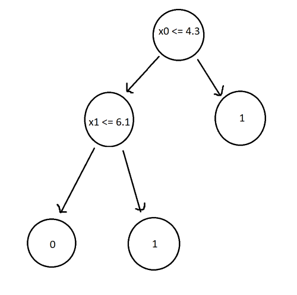
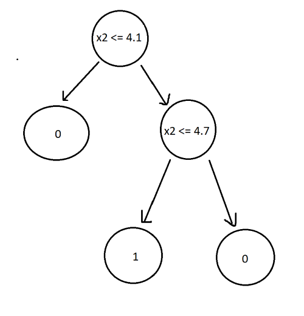
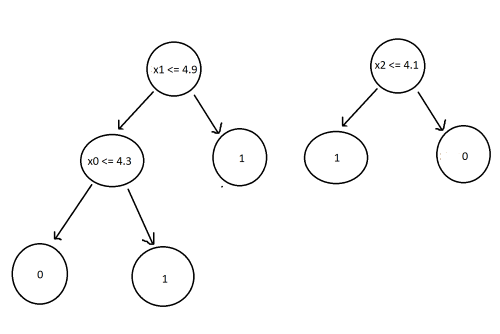
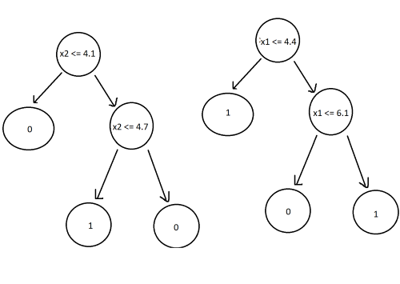

<script type="text/javascript" async src='https://cdnjs.cloudflare.com/ajax/libs/mathjax/2.7.2/MathJax.js?config=TeX-MML-AM_CHTML'></script>

<script type="text/x-mathjax-config">
  MathJax.Hub.Config({ TeX: { extensions: ["color.js"] }});
</script>

<div markdown="1" class="container">

<div class="postTitle"> Random Forest Classifiers </div>
<div class="desc"> RFC's and how they work </div>
<div class="postDate"> Posted by David Wang on April 28, 2023 </div>

## Introduction

Random Forest classifiers are a type of ensemble learning algorithm that combine multiple decision trees to improve the performance and generalization of the model. Each decision tree in the Random Forest is built using a random subset of the features and a random subset of the training data.

## The Problem with Decision Trees

Here's an example. Imagine we're given a dataset with 6 instances, 5 features, and a binary classification of 0 or 1.

| id | x<sub>0</sub> | x<sub>1</sub> | x<sub>2</sub> | x<sub>3</sub> | x<sub>4</sub> | y  |
| :: | :-----------: | :-----------: | :-----------: | :-----------: | :-----------: | :: |
| 0  | 4.3           | 4.9           | 4.1           | 4.7           | 5.5           | 0  |
| 1  | 3.9           | 6.1           | 5.9           | 5.5           | 5.9           | 0  |
| 2  | 2.7           | 4.8           | 4.1           | 5.0           | 5.6           | 0  |
| 3  | 6.6           | 4.4           | 4.5           | 3.9           | 5.9           | 1  |
| 4  | 6.5           | 2.9           | 4.7           | 4.6           | 6.1           | 1  |
| 5  | 2.7           | 6.7           | 4.2           | 5.3           | 4.8           | 1  |

The decision tree classifier for this dataset would look like:



Now, let's change the training data slightly by altering x<sub>0</sub> and x<sub>1</sub> of id 1 to 6.5 and 4.1 respectively. The new decision tree now looks like this:



As you can see, a small change in the data results in a completely different outcome. Trees are highly sensitive to training data, which results in high variance and failure to generalize. 

## Random Forest Classifier

As the name suggests, random forest classifiers uses multiple trees (a forest). The "random" part comes from the way in which the trees are built. We will build 4 new trees (in practice, RFC's build hundreds of new trees).

The first step is to generate new datasets from the original data by randomly picking rows with replacement, a process called boostrapping: 

| sample<sub>1</sub> | sample<sub>2</sub> | sample<sub>3</sub> | sample<sub>4</sub> |
| :----------------: | :----------------: | :----------------: | :----------------: |
| 2                  | 2                  | 4                  | 3                  |
| 0                  | 1                  | 1                  | 3                  |
| 2                  | 3                  | 3                  | 2                  |
| 4                  | 1                  | 0                  | 5                  |
| 5                  | 4                  | 0                  | 1                  |
| 5                  | 4                  | 2                  | 2                  |

Next, we will train a decision tree on each of the boostrapped datasets. However, we won't use every feature to train the tree. Instead, we will randomly choose two features and train the tree with those features only. 

| sample<sub>1</sub> | sample<sub>2</sub> | sample<sub>3</sub> | sample<sub>4</sub> |
| :----------------: | :----------------: | :----------------: | :----------------: |
| x<sub>0</sub>, x<sub>1</sub> | x<sub>2</sub>, x<sub>3</sub> | x<sub>2</sub>, x<sub>4</sub> | x<sub>1</sub>, x<sub>3</sub> |

Decision Trees:





Now we have a random forest classifier. To use it, all we have to do is pass the new data point to every tree and label the most frequent outcome as the classification. 

For example, passing the data point: (2.8, 6.2, 4.3, 5.3, 5.5) to each tree results in classifications of 1, 0, 1, 1. The prediction from our random forest is 1. This process of combining results from multiple models is called aggregation. 

## Conclusion

A random forest classifier works by training a large number of decision trees, each using a randomly sampled subset of the training data (bootstrapping) and a randomly selected subset of the input features (random feature selection). 

Bootstrapping ensures that the same data is not used for every tree, resulting in a model that is less sensitive to changes in the original training data. Random feature selection helps reduce the correlation between the trees. If every feature is used in training the trees, then there is a high chance that trees will have the same decision nodes, causing them to act similarly, increasing the variance. 

The number of features that should be randomly selected is usually close to the square root of the total number of features. 

## Implementing RFC with sklearn

Similar to DTC classifier, we will load breast cancer data and classify tumors. 

```python
from sklearn.datasets import load_breast_cancer
from sklearn.model_selection import train_test_split
from sklearn.ensemble import RandomForestClassifier

data = load_breast_cancer()

x = data.data
y = data.target 
```

Next, we split the data. 80% for training the model, 20% for testing.

```python
x_train, x_test, y_train, y_test = 
 train_test_split(x, y, test_size=0.2)
```

Create the RFC, train it, and test the accuracy.

```python
clf4 = RandomForestClassifier()
clf4.fit(x_train, y_train)
print(f'RFC: {clf4.score(x_test, y_test)}')
```

Output:
```python
RFC: 0.9649122807017544
```

The RFC classifies data points with 95%+ accuracy, an improvement over the DCT's 90%. 


