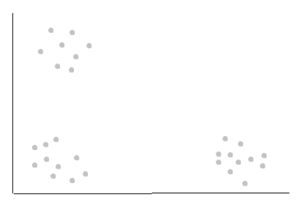
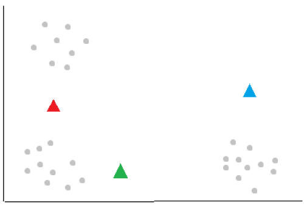
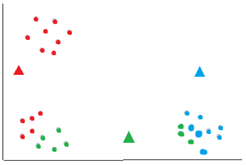
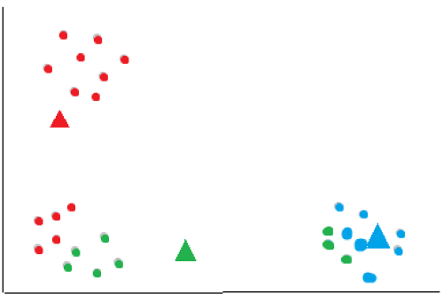
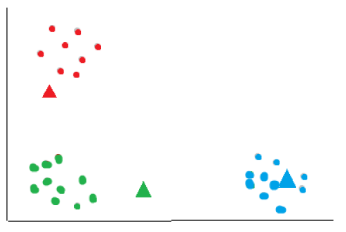
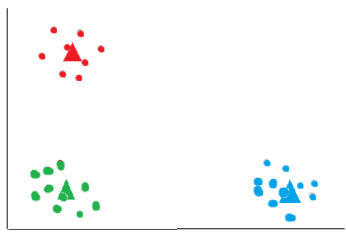

<script type="text/javascript" async src='https://cdnjs.cloudflare.com/ajax/libs/mathjax/2.7.2/MathJax.js?config=TeX-MML-AM_CHTML'></script>

<script type="text/x-mathjax-config">
  MathJax.Hub.Config({ TeX: { extensions: ["color.js"] }});
</script>

<div markdown="1" class="container">

<div class="postTitle"> K-means Clustering </div>
<div class="desc"> The K-means clustering algorithm </div>
<div class="postDate"> Posted by David Wang on May 12, 2023 </div>

## Introduction

K-means clustering is an unsupervised machine learning algorithm that offers a powerful approach to discovering hidden structures in datasets. By grouping similar data points into clusters, K-means clustering allows us to gain valuable insights and make sense of complex information. In this blog post, we'll delve into the inner workings of K-means clustering, exploring its fundamental principles and practical applications.

## Clustering

The main difference between clustering and classifying is clustering uses unlabeled training data to find similarities and patterns while classifying uses labeled data to learn and make predictions/classifications.

The K-means clustering algorithm aims to identify "k" number of clusters within an unlabeled dataset. Here's an example:



In the above data, identifying k=3 clusters is obvious to us humans. However, the computer needs an algorithm: the k-means clustering algorithm. It is also important to note that in real life, data can have many features and the clusters may not be clear. 

## K-means Clustering 

The k-means clustering algorithm works by identifying centroids, which are basically the centers of the clusters. The first step is to randomly initialize "k" number of centroids. In the example above, we'll asign k=3.



The algorithm then looks at each data point and calculates the distance to each centroid using a metric such as the euclidean distance and asigns it to the nearest cluster. 



After all data points have been assigned to clusters, compute the new centroids for each cluster by taking the mean of all data points assigned to that cluster. This moves the centroids to the center of their respective clusters.



The algorithm now repeats the assignment of each data point using the new centroids, reassigning each data point to the nearest updated centroid. 



The assignment of points and updating of centroids is repeated until a stopping critera is met. The stoppoing criteria can be a fixed number of iterations or until the centroids no longer change significantly between iterations. 

The final result:



The k-means algorithm is sensitive to the initial placement of centroids, and different initializations may result in different clustering outcomes. To mitigate this issue, multiple runs with different initializations can be performed, and the clustering solution with the lowest within-cluster sum of squares can be selected as the final result.

## K-means Clustering in python

```python
from sklearn.cluster import KMeans
from sklearn.preprocessing import scale
from sklearn.datasets import load_digits
```

Import the necessary modules. In this example, we will be creating a model to classify handwritten digits from the digits dataset.

```python
digits = load_digits()
data = scale(digits.data)
```

Load and scale the data. Feature scaling is a common preprocessing step that aims to standardize the range of features in a dataset. It ensures that each feature has a similar scale, preventing some features from dominating others due to their larger magnitude. This can be particularly important in machine learning algorithms that are sensitive to the scale of features, such as distance-based algorithms like K-means.

```python
model = KMeans(n_clusters = 10, init='random', n_init = 10)
model.fit(data)
```

Create a model with 10 clusters (one for each digit from 0 to 9), initalizing the centroids randomly, and repeating the process 10 times with different centroid seeds. The final results will be based on the run with the lowest within-cluster error (sum of squared distances between point and centroid).

```python
model.fit(data)
```

Train the model with the data. The model will form 10 clusters, one for each digit. 

To classify a new unknown digit, simply pass in it's feature vector:

```python
model.predict([...])
```

Finally, it doesn't make much sense to test the model beacuse K-means clustering is an unsupervised machine learning algorithm, meaning that we don't have predefined labels or target variables to evaluate the performance of the model. The best measure of how accurate the model is would be a metric like the within-cluster sum of squares. 

## Conclusion

The k-means algorithm aims to minimize the within-cluster sum of squares by iteratively adjusting the centroids and reassigning data points to clusters. It converges when the centroids stabilize, and no further reassignments occur or when the maximum number of iterations is reached.
