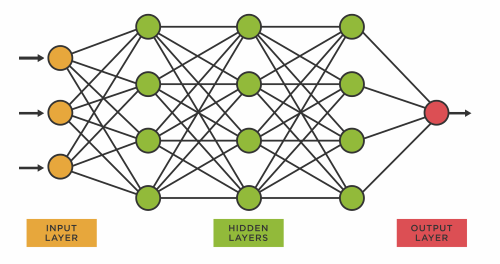
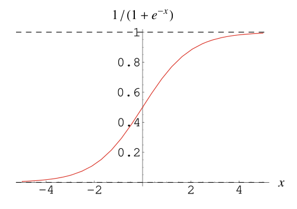
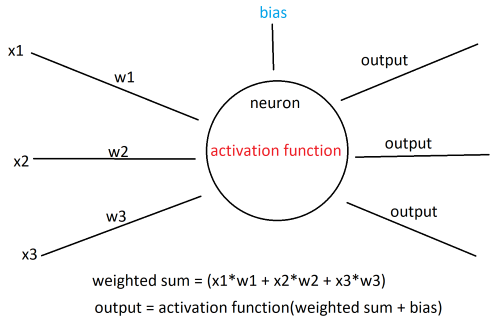

 Neural Networks 

 How neural networks work and the theory behind them 

 Posted by David Wang on May 15, 2023 

## Introduction

Neural networks are a type of machine learning model inspired by the structure and function of the human brain. They are composed of interconnected nodes, called artificial neurons or units, organized in layers. These networks are designed to recognize patterns and relationships in data, and they excel in tasks such as image and speech recognition, natural language processing, and many other complex problems.

## Structure of Neural Networks

The basic building block of a neural network is an artificial neuron, also known as a perceptron. Neurons in a neural network are organized in layers: an input layer, one or more hidden layers, and an output layer. Each neuron in a layer is connected to every neuron in the adjacent layers. 

The input layer receives the raw input data, such as the pixels of an image or the words in a sentence. The hidden layers are responsible for learning and extracting relevant features from the input data. Finally, the output layer produces the network's prediction or output based on the learned features.

## Neurons

Neurons receive input signals, perform computations, and produce output signals. The collective behavior of neurons enables the network to learn and make predictions. Now that we're familiar with the structure of neural networks, let's talk about the individual neurons and how they work. 

1. **Input**: Neurons receive inputs from the neurons in the previous layer or directly from the input data in the case of the first layer. Each input is associated with a weight, which determines the strength or importance of that input for the neuron.

2. **Weighted Sum**: The neuron calculates the weighted sum of its inputs. It multiplies each input by its corresponding weight and sums up these weighted inputs. 

3. **Bias**: A bias term is often included in the neuron's computation. It represents an additional learnable parameter that helps shift the activation function and control the neuron's output.

4. **Activation Function**: The weighted sum of inputs and the bias term are passed through an activation function. This function introduces non-linearity to the neuron's response, allowing it to capture complex patterns and relationships. 

One common activation function is the sigmoid function, which looks like this:

It maps every input into a value between zero and one while also introducing non-linearity to the model. 

Another commonly used activation function is the ReLU function, which maps maps negative inputs to zero and leaves positive values unchanged: 

$$
f(x) = max(0, x)
$$

5. **Output**: The result of the activation function serves as the output of the neuron. This output is then passed as input to the neurons in the next layer, propagating the information forward through the network.

Here's a model of a hidden layer neuron:

## Training the neural network

Training a neural network involves iteratively optimizing its parameters (weights and biases) to minimize a defined loss or error function. 

1. **Initialization**: Initialize the weights and biases of the neural network with small random values. This random initialization provides the starting point for the learning process.

2. **Forward Pass**: Perform a forward pass through the network to obtain predictions for the input data. Starting from the input layer, the data propagates through the network, and each neuron's output is computed based on its weighted sum of inputs and activation function.

3. **Loss Function**: Compare the network's predictions with the true target outputs using a loss function. The loss function measures the discrepancy between the predicted outputs and the actual outputs.

4. **Backpropagation**: Compute the gradients of the loss function with respect to the network's parameters (weights and biases) using the backpropagation algorithm.

5. **Gradient Descent**: Update the network's parameters using an optimization algorithm, typically gradient descent or one of its variants. The gradients obtained from backpropagation guide the update direction, and the learning rate determines the step size in the parameter space. The updated parameters aim to reduce the loss and improve the network's performance.

Steps 2-5 are repeated for multiple epochs or iterations, gradually adjusting the weights and biases of each neuron and improving the model's ability to make accurate predictions.

